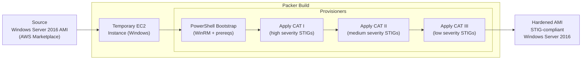

# Windows Server 2016 DISA STIG Image Hardening (Packer)

Packer and Ansible pipeline for building a DISA STIG-compliant Windows Server 2016 AMI on AWS. Based on DISA STIG Version 2, Release 1 (November 2020). Applies CAT I, II, and III security controls via Ansible roles over WinRM.

## Architecture



## Repository Structure

```
├── packer/
│   ├── sources.pkr.hcl       # Source AMI definition (amazon-ebs, Windows)
│   ├── builder.pkr.hcl       # Build block + provisioner sequence
│   ├── variables.pkr.hcl     # Packer input variables
│   └── script.ps1            # PowerShell bootstrap (WinRM + prereqs)
└── ansible/
    ├── stig_playbook.yml     # Main STIG playbook entry point
    ├── inventory             # WinRM inventory
    ├── group_vars/
    │   └── windows-server    # WinRM connection variables
    └── roles/
        └── win-2k16-stig/
            ├── tasks/
            │   ├── prelim.yml  # Preliminary checks
            │   ├── cat1.yml    # CAT I controls
            │   ├── cat2.yml    # CAT II controls
            │   └── cat3.yml    # CAT III controls
            └── defaults/
                └── main.yml    # Per-STIG-ID enable/disable flags
```

## STIG Severity Tags

| Variable | Default | Description |
|----------|---------|-------------|
| `win2016stig_cat1_patch` | `yes` | Apply CAT I (critical) findings |
| `win2016stig_cat2_patch` | `yes` | Apply CAT II (significant) findings |
| `win2016stig_cat3_patch` | `yes` | Apply CAT III (low) findings |

Individual STIG controls can be toggled via `wn16_##_######` variables in `defaults/main.yml`.

## Prerequisites

- Windows Server 2016 (other versions not supported)
- [AWS CLI](https://docs.aws.amazon.com/cli/latest/userguide/getting-started-install.html) configured with IAM credentials
- [Packer](https://learn.hashicorp.com/tutorials/packer/get-started-install-cli) installed
- [Ansible](https://docs.ansible.com/ansible/latest/installation_guide/intro_installation.html) installed

Controller host Python dependencies:
```
passlib, python-lxml, python-xmltodict, python-jmespath, pywinrm
```

## Usage

```shell
aws configure

cd packer
packer init .
packer validate .
packer build .
```

Example playbook usage:
```yaml
- hosts: servers
  roles:
    - role: win-2k16-stig
      when:
        - ansible_os_family == 'Windows'
        - ansible_distribution | regex_search('(Server 2016)')
```
